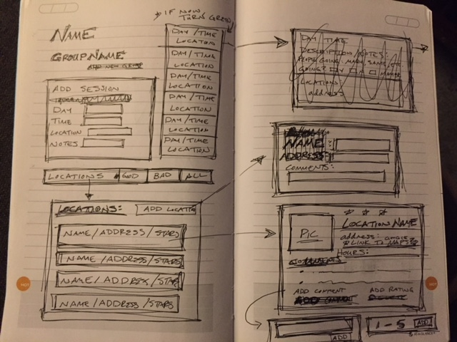
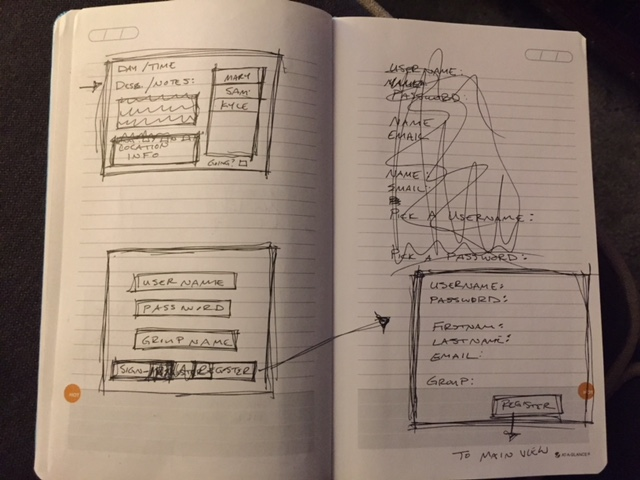

# StudyGroup
### Functional Specification

A. Scott Tribble
Thinkful React Capstone
Last Updated: Sunday, 4 February 2018.

## Overview

StudyGroup is a web-based service that lets people in a given group know where/when someone will be out studying.  
    
It also allows for people to add visited locations to a database with comments (and perhaps ratings).

This spec is not, by any stretch of the imagination, complete.  This is not the final version  and is likely to change.

This spec does not discuss technical information, it just discusses what the user will see as they interact with the StudyGroup app.

## Scenarios

#### Scenario 1:  Scott.
Scott is a student enrolled in a full-time web-development bootcamp that is an online school.  One afternoon, she decides that it would be REALLY NICE to leave her house and finish-up her schoolwork around some other people studying similar things.  Luckily, there are other students enrolled in the same school (although not her particular course) who use StudyGroup.  Scott logs-in and sees that Sally is studying right down the road, right now. She high-tails it to the cafe.

#### Scenario 2:  Mo.
Mo works full-time as a social worker but would really like to attend a web-development bootcamp.  She is working through some pre-requisites for an in-person course, but she is having a little trouble with a few concepts and could really use some help.  She isn't in school yet, so she doesn't have classmates or teachers to ask.  Luckily, she has some friends who are programmers, and they like to get together for coding sessions.  She made them all a StudyGroup, and now she can post that she will be studying on Sunday from 8am-3pm at Anna Bananna's, with the comment that she could use some help.  One of her friends checks his StudyGroup, sees that she'd like some help, and stops in.

## Non Goals

This version will not support the following features:

  - Multiple time-zones for one member.  I will assume all members of  a single group are in the same geographical location.
  - Changing passwords.

This version may not support the following features:

  - Mutiple groups per user.
  - Google API requests for location information.
  - Rating system for locations.

## StudyGroup Wireframes

## Screen by Screen

StudyGroup consists of a variety of views.  All will be executed using React Components.
Each view will be represented in the following document with ALL CAPITOL LETTERS.

## Landing VIEW

The LANDING VIEW will have a Title and brief description of the App (these do not appear in the wireframes).  It will also have a form for user authentication.  There will be two buttons - one for existing user log-in, and one for registering a new user.  (There should probably be a demo account, also).  

## Registration View

From the Register button on the LANDING VIEW, the user will be taken to a REGISTRATION VIEW where they select a Username, a password, and enter their First Name, Last Name, email address, and the name of a group they will be affiliated with.  THere will be a SUBMIT button on this VIEW and after creating an account, the user will flow to the USER VIEW.

## User View

The log-in button on the LANDING VIEW and the submit-registration button on the REGISTRATION VIEW will both flow to the USER VIEW.  The USER VIEW will consist of several components:
  - a heading block with the user's name and their current group
  - a sidebar with items containing day/time/location of active study sessions.
    - if the current time is during the session-time, the item will be green
    - if the session time is over, the item will automatically delete
    - if a user clicks on a session item, they will be sent to a SESSION DETAIL VIEW.
  - an Add Session form where the user can spescify a date, time location, and comments for a new session.  When this is added, a new item will appear on the session side-bar.
  - a locations bar that when clicked will take you to a LOCATIONS VIEW

## Session Detail View

The SESSION DETAIL VIEW will consist of similar components as the USER VIEW.
  - a heading block with the Date/Time of the Session
  - a description/notes block 
  - a Location info block that will show the Name/Address/Ratings info of the location
    - this can similar/same item to LOCATIONS VIEW item for the location
    - when clicked, will take the user to the LOCATION DETAIL VIEW for the item
  - a side-bar listing StudyGroup members who are attending this session
  - a checkbox to indicate if you plan to attend this session  

## Locations View

The LOCATIONS VIEW will contain an alphabetical list of items with the Name, Address, and Rating of each location in the group's database.  There is a button for adding a location that will take a user to the LOCATION ENTRY VIEW,  and when a user clicks on a location item, they will be taken to a LOCATION DETAIL VIEW.

## Location Detail View

The LOCATION DETAIL VIEW will have more detailed information about a given location. 
  - an image if there is one
  - full name
  - address
  - hours of operation
  - StudyGroup rating (if there is one)
  - StudyGroup user comments

The LOCATION DETAIL VIEW will also have two buttons/links.
  - to add a comment which will pop-up an Input Box w/add button
  - to add a rating which will trigger a selector of some sort w/ add button

## LOCATION ENTRY View

The LOCATION ENTRY VIEW will be a form with fields for Location Name, Address, Image and Comments. And a button for form submission.  Once LOCATION ENTRY is submitted, it will take the user back to the LOCATIONS VIEW.

If possible, some of this informaiton could come from google places API - but maybe not for this version.

